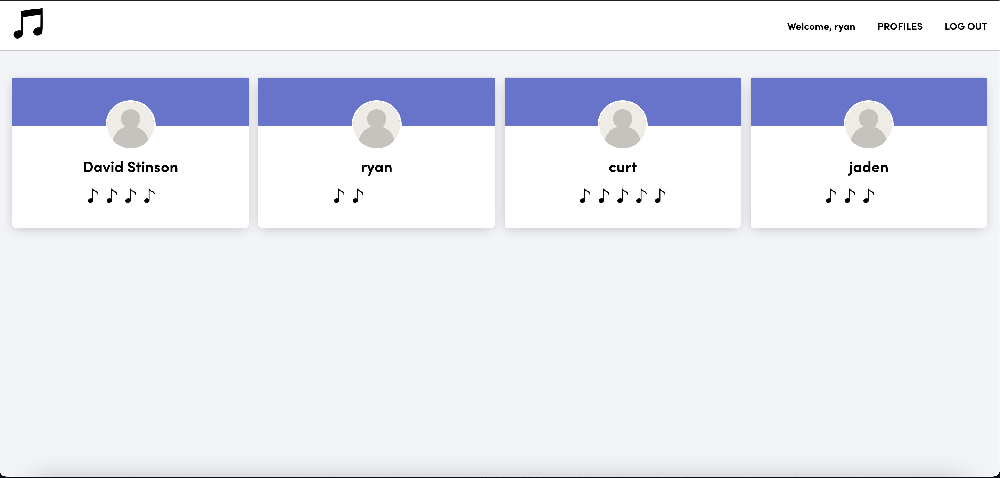

# Flicknote

Flicknote is a web application with CRUD functionality that allows users to rate other profiles with eighth notes.  After appearing on the landing page, you can sign in to create an account.  Once you've signed in, you can rate other profiles with one to five music notes.  If you want to delete your account, there is a Delete Account button at the bottom of the landing page. 

## Getting Started

🖱️ [Click Here](https://flicknote.netlify.app/) to access our application.

📒 [Here](https://trello.com/b/rP6Huel1/flick-project-unit-4) is the link to our planning materials on Trello.

⬅️ [Backend](https://github.com/CaptMerica/meow-meow-beans-v2-back) repo link.

## Technologies used 💾
![Postgresql] (https://img.shields.io/badge/PostgreSQL-316192?style=for-the-badge&logo=postgresql&logoColor=white)

 

## Latest Modifications 🧹
- Included audio clips

## Ice Box 🧊

